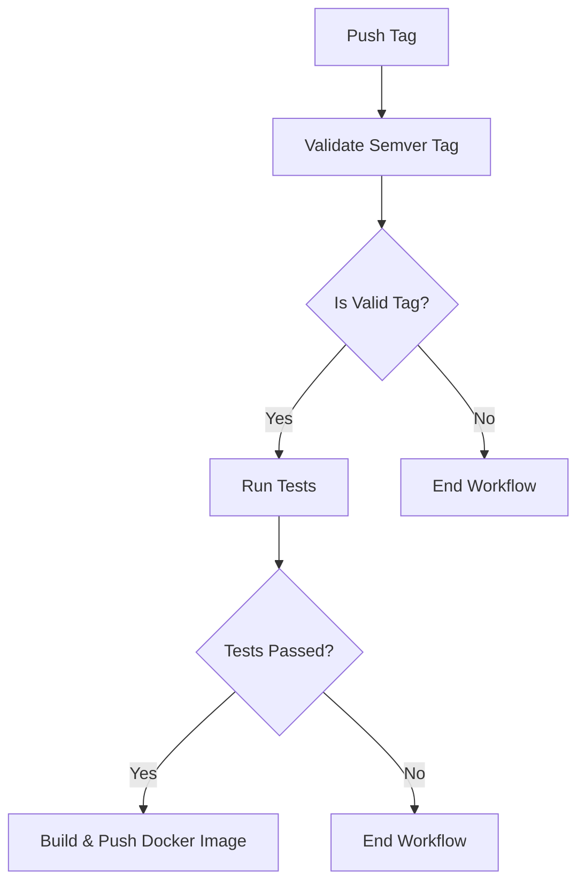

# GitHub Workflows Documentation

This document provides an overview of the CI/CD workflows in this repository.

## Overview

The repository uses GitHub Actions for continuous integration and deployment. The workflows are designed to:

1. Validate code and run tests
2. Build and publish Docker images for tagged releases and the develop branch
3. Maintain code quality through automated checks

## Workflow Structure

### Main Workflows

#### Release Tag Workflow (`release-tag.yml`)

Triggered when a new tag with the pattern `v*.*.*` is pushed. This workflow:

1. Validates that the tag follows semantic versioning
2. Runs tests for the server package
3. Builds and pushes a Docker image to GitHub Container Registry (if tests pass)
4. Tags the image with the version number and 'latest'



#### Develop Branch Workflow (`develop-push.yml`)

Triggered when code is pushed to the develop branch. This workflow:

1. Runs tests for the server package
2. Builds and pushes a Docker image to GitHub Container Registry with the 'dev' tag (if tests pass)

#### Main Branch Workflow (`main-push.yml`)

Triggered when code is pushed to the main branch. This workflow:

1. Runs tests for the server package

#### Pull Request Workflow (`pull-request.yml`)

Triggered when a pull request is opened or updated for the main or develop branches. This workflow:

1. Runs tests for the server package

### Reusable Workflows

#### Test Workflow (`reusable-test.yml`)

A reusable workflow that handles testing. It:

1. Sets up Node.js (v22) and pnpm
2. Builds the application
3. Runs tests and collects coverage
4. Uploads test results and coverage reports as artifacts

### Shared Actions

#### Setup Node and pnpm (`setup-node-pnpm`)

Sets up Node.js (v22) and pnpm with caching for faster installations. Uses non-frozen lockfile to ensure compatibility.

#### Validate Semver Tag (`validate-semver-tag`)

Validates that a tag follows semantic versioning format (v*.*.*)

## Dependencies

The workflows expect jsdom to be included in the package.json of the server application for DOM testing with Vitest.

## Docker Images

The workflow uses GitHub's official Docker actions directly:
- `docker/setup-buildx-action` - For setting up Docker Buildx
- `docker/login-action` - For authenticating with GitHub Container Registry
- `docker/metadata-action` - For generating image tags and labels
- `docker/build-push-action` - For building and pushing Docker images

Important Docker build configuration:
- Context is set to the repository root (`.`)
- Dockerfile path is explicitly set to `apps/server/Dockerfile`
- Cache is enabled for faster builds using GitHub Actions cache

### Simplified Dockerfile Structure

The Dockerfile has been simplified to use a two-stage build approach:

1. **Builder Stage**:
   - Uses Node.js 22 Alpine as the base image
   - Copies the entire repository into the container
   - Installs dependencies with `--no-frozen-lockfile` to avoid dependency conflicts
   - Builds the application using the pnpm filter

2. **Production Stage**:
   - Uses a fresh Node.js Alpine image
   - Copies only the built application and package.json
   - Installs only production dependencies
   - Results in a smaller final image with no build tools or source code

## Badges

Workflow status can be displayed in the README.md using the following badge:

```markdown
[](https://github.com/cbnsndwch/react-router-nest/actions/workflows/release-tag.yml)
```

## Troubleshooting

If the workflow fails, check:

1. **Missing dependencies**: Ensure all required dependencies are in the package.json
2. **Node.js version**: The workflow expects Node.js v22+ as specified in the server package.json
3. **Tag format**: Ensure release tags follow the semantic versioning format v*.*.* (e.g., v1.0.0)
4. **Test failures**: Look at test artifacts for details on failing tests
5. **Docker build context**: The Dockerfile expects to be built from the repository root. If you modify the workflows, ensure the Docker context is set to `.` (repository root) and the file parameter points to `apps/server/Dockerfile`
